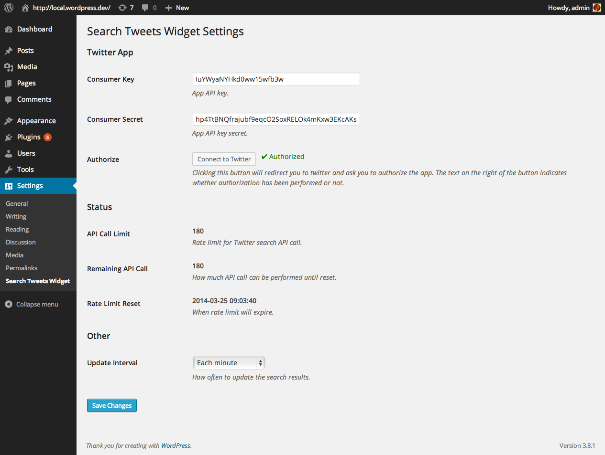
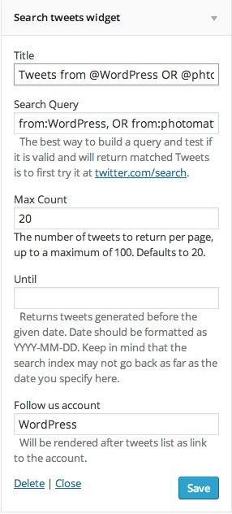

<!-- DO NOT EDIT THIS FILE; it is auto-generated from readme.txt -->
# Search Tweets Widget

Provides Twitter query search, like `from:WordPress, OR from:photomatt`, and gets the search results rendered as a widget.

**Contributors:** [akeda](http://profiles.wordpress.org/akeda), [westonruter](http://profiles.wordpress.org/westonruter), [xwp](http://profiles.wordpress.org/xwp)  
**Tags:** [twitter](http://wordpress.org/plugins/tags/twitter), [search](http://wordpress.org/plugins/tags/search), [widget](http://wordpress.org/plugins/tags/widget)  
**Requires at least:** 3.6  
**Tested up to:** 3.8.1  
**Stable tag:** trunk (master)  
**License:** [GPLv2 or later](http://www.gnu.org/licenses/gpl-2.0.html)  

## Description ##

Provides Twitter query search, like `from:WordPress, OR from:photomatt`, and gets the search results rendered as a widget. The results will get updated frequently.

**Development of this plugin is done on [GitHub](https://github.com/xwp/wp-search-tweets-widget). Pull requests are always welcome**.

## Installation ##

### How to use ###
1. Go to **Appearance** > **Widgets**
1. Drag **Search tweets widget** from **Available Widgets** to available widget area
1. Fill **Search Query** in widget form, something like `from:WordPress, OR from:photomatt`
1. For more query operators, check <a href="https://dev.twitter.com/docs/using-search">the doc</a>

## Frequently Asked Questions ##

### How do I change widget's markup? ###
There's a filter `search_tweets_widget_view_path_for_widget` where you can override view path. Please take a look at `views/widget.php` for reference.

## Screenshots ##

### Settings page

### Widget form

### Rendered widget

## Changelog ##

### 0.1.0 ###
Initial release

